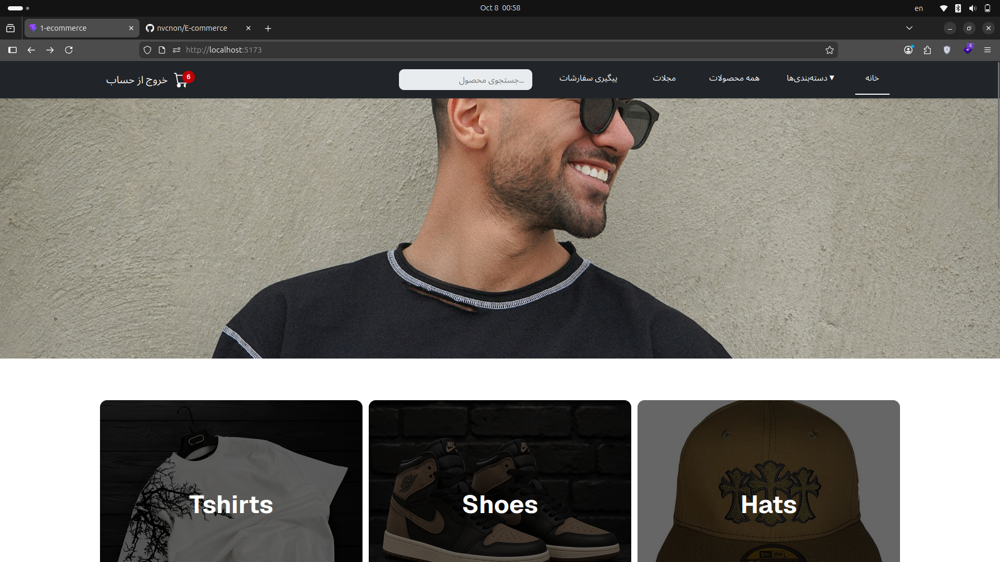
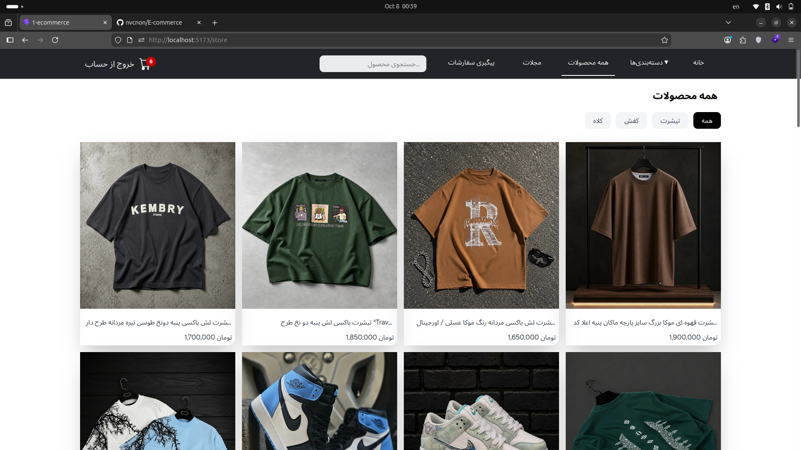
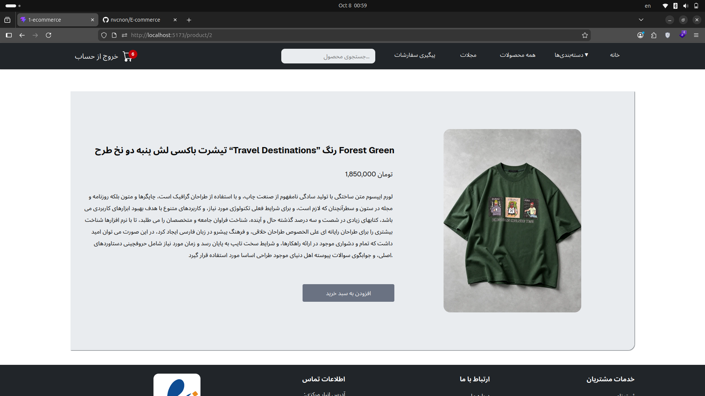
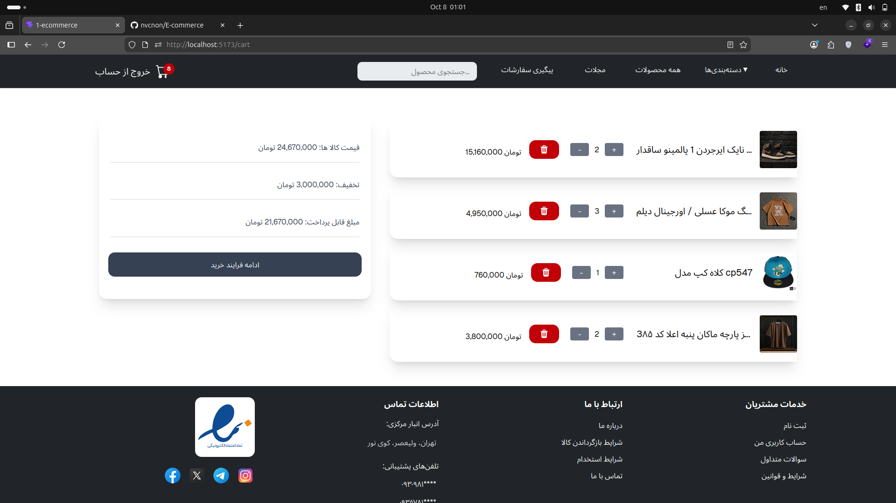

# 🛍️ E-Commerce — React + TypeScript

A modern and responsive e-commerce frontend built with **React, TypeScript, React Router, Tailwind CSS, Axios, Context API, and JSON Server**.

This project demonstrates a real-world frontend architecture with reusable components, global state management, protected routes, API communication, URL-based filtering, local persistence, and responsive UI.

---

## 📸 Screenshots

### 🏠 Home Page



### 🛍️ Store



### 📦 Product Details



### 🛒 Shopping Cart



### 🔐 Login


### 📰 Magazine


---

## ✨ Features

* Product listing and product details
* Product search
* Category filtering
* URL-based search and filtering
* Shopping cart
* Increase / decrease product quantity
* Remove products from cart
* Cart total calculation
* Authentication
* Login / Logout
* Protected routes
* Local Storage persistence
* Magazine / Blog section
* Responsive design
* Reusable components
* Swiper-based interactive sections

---

## 🛠️ Tech Stack

### Frontend

* React
* TypeScript
* React Router
* Tailwind CSS
* Axios
* Context API
* Custom Hooks
* Swiper

### Development

* Vite
* JSON Server
* Git
* GitHub

---

## 🔄 Architecture

The application separates UI components, global state, API communication, and reusable logic.

### API Flow

```text id="y4j7zq"
React Components
       ↓
services/api.ts
       ↓
     Axios
       ↓
   JSON Server
```

### Authentication Flow

```text id="0m7fqi"
Login Page
    ↓
Authentication Context
    ↓
services/api.ts
    ↓
JSON Server
```

Authentication state is shared across the application using React Context API.

### Shopping Cart Flow

```text id="2x9r4c"
Product
   ↓
ShoppingCartContext
   ↓
Cart State
   ↓
Local Storage
```

Cart state is managed globally through Context API and persisted using Local Storage.

---

## 🔐 Authentication

The project includes a simple authentication flow for demonstrating login, logout, and protected routes.

Users can:

* Login
* Logout
* Access protected pages
* Maintain authentication state across the application

The cart page is protected using a reusable `PrivateRoute` component.

> **Note:** Authentication uses JSON Server as a mock backend and is intended for frontend demonstration purposes, not production security.

---

## 🛒 Shopping Cart

The shopping cart is implemented using **React Context API**.

Users can:

* Add products to the cart
* Increase quantity
* Decrease quantity
* Remove products
* View total quantity
* View total price

Cart data is persisted using Local Storage.

---

## 🔎 Search & Category Filtering

The Store page supports product search and category filtering.

Filtering state is synchronized with the URL using React Router search parameters.

Examples:

```text id="qf9d3r"
/store?category=Shoes
```

```text id="s6w2pc"
/store?category=Tshirt
```

```text id="k2x8mz"
/store?search=shirt
```

Using URL search parameters makes filtering state shareable and keeps navigation predictable.

---

## 🧩 Reusable Components

The project follows a reusable component-based architecture.

Examples include:

* Navbar
* Footer
* Container
* Product Item
* Cart Item
* Product Section
* Category Section
* Responsive Breakpoints
* Private Route
* Layout

This structure keeps UI logic modular and makes the application easier to maintain.

---

## 🪝 Custom Hooks

The project includes a reusable `useLocalStorage` hook for synchronizing React state with browser Local Storage.

Example:

```tsx id="p8d2vz"
const [value, setValue] = useLocalStorage("key", initialValue);
```

This keeps Local Storage logic reusable instead of duplicating it across components.

---

## 📱 Responsive Design

The application is designed to provide a consistent experience across:

* Desktop
* Tablet
* Mobile

Responsive layouts are implemented using Tailwind CSS and responsive Swiper configurations.

---

## 🎞️ Interactive UI

Swiper is used for interactive product and category sections.

Implemented features include:

* Responsive slides
* Pagination
* Navigation
* Autoplay
* Coverflow effects

---

## 🗺️ Routes

| Route           | Description      |
| --------------- | ---------------- |
| `/`             | Home             |
| `/store`        | Product Store    |
| `/product/:id`  | Product Details  |
| `/cart`         | Shopping Cart    |
| `/login`        | Login            |
| `/about`        | About            |
| `/magazine`     | Magazine         |
| `/magazine/:id` | Magazine Article |

---

## 🚀 Getting Started

### 1. Clone the repository

```bash id="f1q6cw"
git clone https://github.com/nvcnon/E-commerce.git
cd E-commerce
```

### 2. Install dependencies

```bash id="b3x8ka"
npm install
```

### 3. Start JSON Server

The project uses JSON Server as a local mock backend.

```bash id="j7p4qm"
npm run api
```

### 4. Start the development server

Open another terminal and run:

```bash id="r9c2vd"
npm run dev
```

The frontend and mock API should be running simultaneously.

---

## 🧪 Demo Account

For testing the authentication flow:

```text id="u6k3pz"
Email: test@gmail.com
Password: 123456
```

> This account is intended for local development and demonstration purposes.

---

## 👨‍💻 Author

**Sajjad Naghavi**

Frontend Developer

📍 Qom / Tehran, Iran

📧 [nvcnon@gmail.com](mailto:nvcnon@gmail.com)

💻 [GitHub](https://github.com/nvcnon)

---

## 📄 License

This project was created for educational and portfolio purposes.

